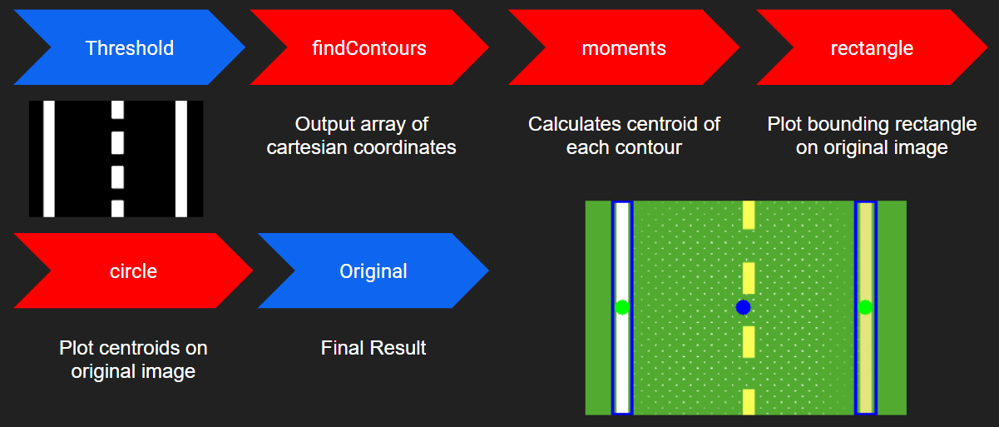

# ucsd_robo_car_simple_ros

### A simple ROS package using OpenCV on a 1/10 RC car chassis with ackerman steering that can detect and track road lines or lanes in a driver-less mode. 

## Table of Contents

  - [**Enable X11 forwarding**](#7-enable-x11-forwarding)
  - [**Work Flow To Use This Repository**](#work-flow-to-use-this-repository)
  - [**Nodes**](#nodes)
    - [throttle_client](#throttle_client)
    - [steering_client](#steering_client)
    - [camera_server](#camera_server)
    - [lane_detection_node](#lane_detection_node)
    - [lane_guidance_node](#lane_guidance_node)
    - [ros_racer_calibration_node](#ros_racer_calibration_node)
  - [**Topics**](#topics)
    - [steering](#steering)
    - [throttle](#throttle)
    - [camera_rgb](#camera_rgb)
    - [centroid](#centroid)
  - [**Launch**](#launch)
    - [throttle and steering launch](#throttle-and-steering-launch)
    - [lane detection launch](#lane-detection-launch)
    - [ros racer calibration launch](#ros-racer-calibration-launch)
    - [ros racer launch](#ros-racer-launch)
  - [**Tools**](#tools)
    - [ROS Guide Book](#ros-guide-book)
    - [Run Indvidual Programs](#run-indvidual-programs)
    - [Decoder](#decoder)
  - [**Troubleshooting**](#troubleshooting)
    - [Camera not working](#camera-not-working)
    - [Throttle and steering not working](#throttle-and-steering-not-working)
    - [Error With CV_Bridge Conversion From Image Message To OpenCV Image](#error-with-cv_bridge-conversion-from-image-message-to-opencv-image)
    - [ROS Version Is Not Compatible with Python3](#ros-version-is-not-compatible-with-python3)
  - [**Demonstration videos**](#demonstration-videos)
    - [Lane detection example with yellow filter](#lane-detection-example-with-yellow-filter)
    - [Blue color detection](#blue-color-detection)
    - [Yellow color detection and line width specification](#yellow-color-detection-and-line-width-specification)
    - [Throttle and steering](#throttle-and-steering)
    - [Manipulating image dimensions](#manipulating-image-dimensions)

## **Enable X11 forwarding**

Associated file: **x11_forwarding_steps.txt**

Some jetsons may not have this enabled, so if needed please read the steps in this file to setup X11 forwarding

## **Work Flow To Use This Repository**

1. Pull docker image <a href="https://hub.docker.com/repository/docker/djnighti/ucsd_robo_car_simple_ros" >here</a> for this repo that contains this repo and all its dependecies for plug-n-play use. This link provides neccessary instructions for running the docker container.

2. Calibrate the camera, throttle and steering values using the [ros_racer_calibration_node](#ros_racer_calibration_node)

`roslaunch ucsd_robo_car_simple_ros ros_racer_calibration_launch.launch`

3. Launch [ros racer launch](#ros racer launch)

`roslaunch ucsd_robo_car_simple_ros ros_racer_launch.launch`

4. Tune parameters in step 2 until desired behavior is achieved

## Nodes

### **throttle_client**

Associated file: **throttle_client.py**

This node subscribes to the [**throttle**](#Topics) topic. We use subscriber callback function
to validate and normalize throttle value, and then use the [**adafruit_servokit**](#adafruit_servokit)
module on **channel 2** for sending signals to the hardware.

This node is also responsible for reading and setting the throttle calibration values.

### **steering_client**

Associated file: **steering_client.py**

Similar to [**throttle_client**](#throttle_client), this node subscribes to the [**steering**](#Topics)
topic and passes the signals to the hardware. The steering servo is on **channel 1**.

Plenty of information on how to use the adafruit_servokit libraries can be found <a href="https://learn.adafruit.com/16-channel-pwm-servo-driver/python-circuitpython" >here</a> and <a href="https://github.com/adafruit/Adafruit_CircuitPython_ServoKit" >here</a> 

### **camera_server**

Associated file: **camera_server.py**

This node simply reads from the camera with cv2's interface and publishes the image to the
[**camera_rgb**](#Topics) topic. Before publishing, the image is reformatted from the cv image format
so it can be passed through the ROS topic message structure.

### **lane_detection_node**

Associated file: **lane_detection.py**

This node subscribes from the [**camera_rgb**](#Topics) topic and uses opencv to identify line
information from the image, and publish the information of the lines centroid to the [**centroid**](#centroid). 

The color scheme is defined as follows:

- 2 contours : green bounding boxes and a blue average centroid
- 1 contour : green bounding box with a single red centroid

Below show the image post processing techniques, cv2 methods and the logic applied respectively.

  
  
  

### **lane_guidance_node**

Associated file: **lane_guidance.py**

This node subscribes to the centroid topic, calculates the throttle and steering
based on the centroid value, and then publish them to their corresponding topics.
Throttle is based on error threshold specified in the [ros_racer_calibration_node](#ros_racer_calibration_node) 

| Error Threshold State| Throttle Response |
| ------ | ------ |
| error < error_threshold | car goes **faster** |
| error > error_threshold | car goes **slower** |

Steering is based on a proportional controller and the error threshold by calculating the error between the centroid (found in [**lane_detection_node**](#lane_detection_node)) and the heading of the car. 

| Error Threshold State| Steering Response |
| ------ | ------ |
| error < error_threshold | car steers **straight** |
| error > error_threshold | car steers **toward error** |

### **ros_racer_calibration_node**

Associated file: **ros_racer_calibration_node.py**

**These values are saved automatically to a configuration file, so just press** `control-c` **when the car is calibrated.**

Calibrate the camera, throttle and steering in this node by using the sliders to find:
- the right color filter 
- desired image dimmensions
- throttle values for both the optimal condtion (error = 0) and the non optimal condtion (error !=0) AKA go fast when error=0 and go slow if error !=0
- steering sensitivty change the Kp value to adjust the steering sensitivty. A value too high or low can make the car go unstable (oscillations in the cars trajectory)

| Kp value | Steering Response |
| ------ | ------ |
| as Kp --> 1 | steering more responsive |
| as Kp --> 0 | steering less responsive |

| Property   | Info |
| ----------  | --------------------- |
| lowH, highH | Setting low and high values for Hue  | 
| lowS, highS | Setting low and high values for Saturation | 
| lowV, highV | Setting low and high values for Value | 
| Inverted_filter | Specify to create an inverted color tracker | 
| min_width, max_width | Specify the width range of the line to be detected  | 
| number_of_lines | Specify the number of lines to be detected  | 
| error_threshold | Specify the acceptable error the robot will consider as approximately "no error" | 
| frame_width | Specify the width of image frame (horizontal cropping) | 
| rows_to_watch | Specify the number of rows (in pixels) to watch (vertical cropping) | 
| rows_offset | Specify the offset of the rows to watch (vertical pan) | 
| Steering_sensitivity | Specify the proportional gain of the steering | 
| Steering_value | Specify the steering value | 
| Throttle_mode | Toggle this slider at the end of calibration to the following 3 modes. |
| Throttle_mode 0 | zero_throttle_mode (find value where car does not move) 
| Throttle_mode 1 | zero_error_throttle_mode (find value for car to move when there is **no error** in steering)
| Throttle_mode 2 | error_throttle_mode(find value for car to move when there is **some error** in steering)| 
| Throttle_value | Specify the throttle value to be set in each of the throttle modes| 

More morphological transfromations and examples can be found <a href="https://docs.opencv.org/3.4/db/df6/tutorial_erosion_dilatation.html" >here</a> and <a href="https://docs.opencv.org/master/d9/d61/tutorial_py_morphological_ops.html" >here</a>

## Topics

### **throttle** 
| Name       | Msg Type              | Info                                                       |
| ---------- | --------------------- | ---------------------------------------------------------- |
| /throttle   | std_msgs.msg.Float32  | Float value from -1 to 1 for controlling throttle          |

#### **steering**
| Name       | Msg Type              | Info                                                       |
| ---------- | --------------------- | ---------------------------------------------------------- |
| /steering   | std_msgs.msg.Float32  | Float value from -1 to 1 for controlling steering          |

#### **camera_rgb**
| Name       | Msg Type              | Info                                                       |
| ---------- | --------------------- | ---------------------------------------------------------- |
| /camera_rgb | sensor_msgs.msg.Image | Image last read from USB camera image                      |

#### **centroid**
| Name       | Msg Type              | Info                                                       |
| ---------- | --------------------- | ---------------------------------------------------------- |
| /centroid   | std_msgs.msg.Float32  | Float value for that represents the error of the x coordinate of centroid in camera image space|

## Launch

#### **throttle and steering launch**

Associated file: **throttle_and_steering_launch.launch**

This file launches both [**throttle_client**](#throttle_client) and [**steering**](#Topics) seperately because these topics can take some time to initialize which can delay productivity. Launch this script once and use the other launch files listed below to get the robot moving.

`roslaunch ucsd_robo_car_simple_ros throttle_and_steering_launch.launch`

#### **lane Detection launch**

Associated file: **laneDetection_launch.launch**

This file will launch [**lane_detection_node**](#lane_detection_node), [**lane_guidance_node**](#lane_guidance_node), [**camera_server**](#camera_server) and load the color filter parameters created using [ros_racer_calibration_node](#ros_racer_calibration_node)

**Before launching, please calibrate the robot first while on the stand!**

`roslaunch ucsd_robo_car_simple_ros laneDetection_launch.launch`

#### **ros racer calibration launch**

Associated file: **ros_racer_calibration_launch.launch**

[ros_racer_calibration_node](#ros_racer_calibration_node)

This file will launch [**camera_server**](#camera_server), [ros_racer_calibration_node](#ros_racer_calibration_node) and [throttle and steering launch](#throttle-and-steering-launch)

`roslaunch ucsd_robo_car_simple_ros ros_racer_calibration_launch.launch`

#### **ros racer launch**
[ros racer launch](#ros racer launch)
This file will launch [throttle and steering launch](#throttle-and-steering-launch) and [lane detection launch](#lane-detection-launch)

`roslaunch ucsd_robo_car_simple_ros ros_racer_launch.launch`

## Tools 

#### ROS Guide Book

For help with using ROS in the terminal and in console scripts, check out this google doc <a href="https://docs.google.com/document/d/1u7XS7B-Rl_emK3kVKEfc0MxHtwXGYHf5HfLlnX8Ydiw/edit?usp=sharing" >here</a> to see tables of ROS commands and plenty of examples of using ROS in console scripts.

#### **Run Indvidual Programs**

To run any indvidual program, enter this into the terminal and change file_name.py to whatever python file is in the repo

`rosrun ucsd_robo_car_simple_ros file_name.py`

#### **Decoder** 

Associated file: **decoder.py**

This provides a solution for cv_bridge not working and decodes the incoming image into a numpy array that is then passed to the [**camera_rgb**](#Topics) topic. If cv_bridge is built with python3, then this file is not neccessary.

## Troubleshooting

#### **Camera not working** 

If while running [deepracer_calibration_node](#deepracer_calibration_node) or [aws_rosracer.launch](#aws_rosracerlaunch) and if the cv2 windows do not open, then follow the procedure below to potentially resolve the issue.

1. Make sure camera is plugged in all the way into its USB socket
1. See if image feed is coming through in another application like cheese. (Enter `cheese` into terminal window)
1. Check to see if the camera topic is publishing data `rostopic echo /camera_rgb`
1. Restart ROS core 
1. Reboot if none of the above worked and try again `sudo reboot now`

If the camera is still not working after trying the procedure above, then it could be a hardware issue. (Did the car crash?)

#### **Throttle and steering not working** 

If while running [ros_racer_calibration_node](#ros_racer_calibration_node) or [ros racer launch](#ros racer launch) and the throttle and steering are unresponsive, then follow the procedure below to potentially resolve the issue.

1. Make sure ESC is turned on
1. Make sure battery is plugged in
1. Make sure battery has a charge
1. Make sure servo and ESC wires are plugged into the pwm board into the correct channels correctly
1. Check to see if the steering and throttle topics are publishing data `rostopic echo /steering` and `rostopic echo /throttle`
1. Verify that the throttle values found in [ros_racer_calibration_node](#ros_racer_calibration_node) were loaded properly when running  [ros racer launch](#ros racer launch) (Values will be printed to the terminal first when running the launch file) 
1. Restart ROS core 
1. Reboot if none of the above worked and try again `sudo reboot now`

If the Throttle and steering are still not working after trying the procedure above, then it could be a hardware issue. (Did the car crash?)

#### **Error With CV_Bridge Conversion From Image Message To OpenCV Image**

Using **bridge_object.imgmsg_to_cv2()** threw errors on our Jetson Nano environment, so we had to resort to our own image decoder function. Function **decodeImage()** can be imported from **decoder.py**. If you don't want to use our function, the problem can be avoided by properly building CV_Bridge with Python3 in the ROS package.

An alternative solution can be found <a href="https://medium.com/@beta_b0t/how-to-setup-ros-with-python-3-44a69ca36674" >here</a>

### **ROS Version Is Not Compatible with Python3**
If your're having issues using python3, then there is a chance that the virtual environment (explained in [**Environment Configuration**](#environment-configuration)) was not setup properly. Try setting up another environment to see if that solves the issue.

More info found 
<a href="https://medium.com/@beta_b0t/how-to-setup-ros-with-python-3-44a69ca36674" >here</a>

## **Demonstration videos** 

#### Lane detection example with yellow filter

#### Number of lines to detect

#### Error threshold

#### Blue color detection

#### Yellow color detection and line width specification

#### Throttle and steering

#### Manipulating image dimensions

